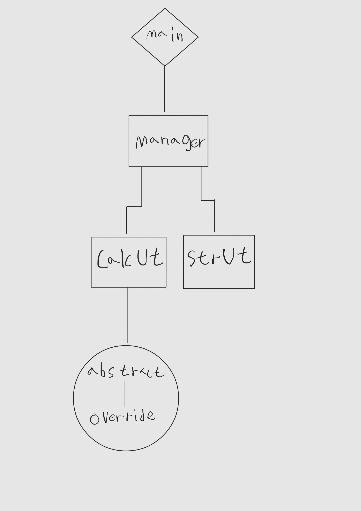

# 계산기 프로그램 설명서
---
## 콘솔창에서 수식쓰기

프로그램 이용법을 알 수 있습니다.
 

### 단일 수식

단일수식을 작성 후 엔터키를 누르면 계산합니다.

### 연쇄 수식

연쇄수식은 앞에 "$"를 붙여 호출합니다.

---
## 예외처리

예외처리에 대해 알 수 있습니다.
 

잘못된 식이면, 에러메세지를 띄웁니다.

입력이 잘못되었다면, 해당 메세지를 띄웁니다.

숫자가 아닌 값을 계산을 하려하면, 해당 메세지를 띄웁니다.

---
## 부가기능

부가기능에 대해 알 수 있습니다.
 

의미 없는 문자가 들어가 있어도, 계산식을 추출해 냅니다.

음수와 소수에 대한 계산이 가능합니다. (소수둘째자리까지 표현하며, 코틀린의 StringFormat에 따릅니다.)

---
## 프로그램 구조

프로그램 구조를 간략히 도식화 합니다.
 

---
## 함수설명

적용된 함수의 역할을 간략히 설명합니다.
 

---
### Calculator Class
Calculator Class는 추상클래스로 되어 있고, 추상함수 하나만을 가지고 있으며,
자식클래스에서 Override하여 함수를 구체화 합니다.

---
### Manager Class
Manager Class는 프로그램의 메인 클래스 입니다. 

#### fun manual()

= 프로그램의 메인이 되는 함수입니다. 계산기의 시퀀스를 관리합니다.

#### private fun inputCalculate(): String

= 사용자와 대화를 하는 함수입니다. 해당함수에서 입력을 받습니다.

---
### StringUtile Class
StringUtile Class는 문자열 포맷과 변환을 수행합니다.

#### private fun stringFilter(inputString: String):String

= 입력받은 문자열을 1차적으로 필터링 합니다. 의미없는 문자를 무시합니다.

#### private fun convertString(inputString: String): String 

= 필터링된 문자에서 연산자와 숫자를 추출합니다. 해당 함수에서 소수점과 음수에 대한 대응을 하고, 

최종적으로 파싱가능한 계산 식을 도출해 냅니다.

#### private fun getParsingList(inputString: String):List<String>

= 파싱가능한 문자열을 리스트 형태로 반환하여 핸들링이 용이하게 합니다. 

해당 함수는 단일 계산 로직에서 사용합니다.

#### fun postfixConvert(inputString: String):List<String> 

= 파싱가능한 문자열을 알고리즘을 거쳐 후위연산을 도출한 리스트로 반환합니다.

해당 함수는 연쇄 수식 로직에서 사용합니다.

#### private fun getPriority(operator: String): Int

= 후위연산 변환 알고리즘에 필요한 우선순위 함수입니다.

---
### CalculateUtile Class
CalculateUtile Class는 Calculator Class와의 연결을 수행하며, 

적절한 호출로 단일, 연쇄 식을 적용합니다.

#### private fun calculate(x: Double, y: Double, oper: String):Double

= 전달 받은 인자를 통해 추상클래스를 호출하여 결과를 리턴합니다. 직접적인 계산은 이 함수틑 통합니다.

#### fun postfixResult(postfix: List<String>)

= 연쇄수식의 계산 알고리즘을 통해 calculate함수틑 통한 값들의 최종적 결과를 리턴합니다.

####  fun singleResult(calculate: List<String>)

= 단일수식의 최종결과를 리턴합니다.

