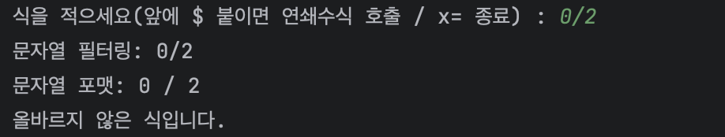
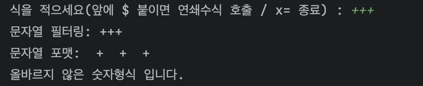
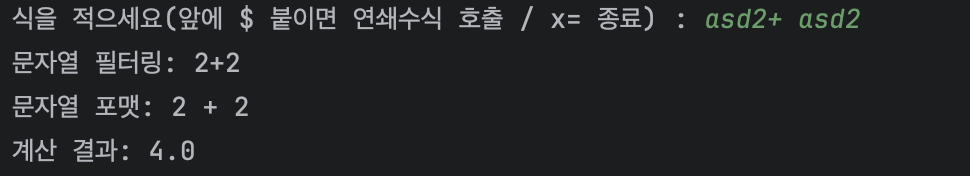
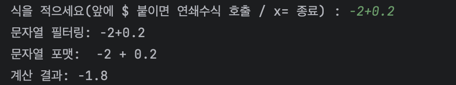

# 계산기 프로그램 설명서
---

콘솔창에서 수식쓰기
 

### 단일 수식

단일수식을 작성 후 엔터키를 누르면 계산합니다.

### 연쇄 수식

연쇄수식은 앞에 "$"를 붙여 호출합니다.

---

예외처리
 

잘못된 식이면, 에러메세지를 띄웁니다.

입력이 잘못되었다면, 해당 메세지를 띄웁니다.

숫자가 아닌 값을 계산을 하려하면, 해당 메세지를 띄웁니다.

---

부가기능
 

의미 없는 문자가 들어가 있어도, 계산식을 추출해 냅니다.

음수와 소수에 대한 계산이 가능합니다. (소수둘째자리까지 표현하며, 코틀린의 StringFormat에 따릅니다.)

